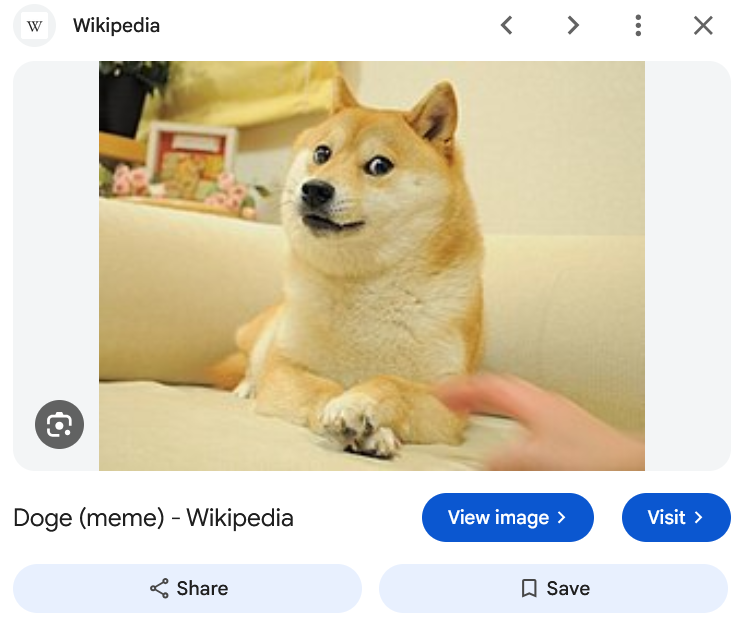

# View Image — maintained Google Images extension

**Bring the direct “View image” button back to Google Images.** View Image is a
free, open-source browser extension for **Firefox and Chromium browsers**,
maintained by **Kevin Elias**.

[](https://github.com/kevinjhampier/ViewImage/releases/download/v5.3.4/ViewImage-5.3.4-firefox.xpi)
[](https://kevinjhampier.github.io/ViewImage/install.html#chromium)
[](https://github.com/kevinjhampier/ViewImage/releases/latest)
[](https://github.com/kevinjhampier/ViewImage/tree/master/js)

This project continues Joshua Butt's original
[`bijij/ViewImage`](https://github.com/bijij/ViewImage). Google changed its image
result panels, breaking the original selectors. This maintained version detects
the selected image and its destination action semantically, supports current
URL modes such as `udm=imgs`, and updates the button as you move between results.
It is independently maintained and is not an official upstream release or a
Google product. Version 5.3.4 restores direct image viewing; it does not add a
separate reverse-image-search button.

**[Official website](https://kevinjhampier.github.io/ViewImage/)** ·
[Installation guide](https://kevinjhampier.github.io/ViewImage/install.html) ·
[Troubleshooting](https://kevinjhampier.github.io/ViewImage/troubleshooting.html) ·
[Privacy](https://kevinjhampier.github.io/ViewImage/privacy.html)



## Install

- **Firefox desktop:** download the [Mozilla-signed XPI](https://github.com/kevinjhampier/ViewImage/releases/download/v5.3.4/ViewImage-5.3.4-firefox.xpi).
  If Firefox does not show an installation prompt, use `about:addons` → gear menu
  → **Install Add-on From File…** and select the XPI.
- **Chrome / Chromium / Edge desktop:** download the [Chromium ZIP](https://github.com/kevinjhampier/ViewImage/releases/download/v5.3.4/ViewImage-5.3.4-chromium.zip),
  extract it, enable **Developer mode** at `chrome://extensions` (or
  `edge://extensions`), and choose **Load unpacked**. Keep the extracted folder.

Reload Google Images after installing, then select a result to open its preview.
The restored button opens the image directly when its full-size URL is available.
Mobile browsers are not a supported target. This fork is distributed through
GitHub Releases; it has no Chrome Web Store listing.

## What this version fixes

- Supports `udm=imgs`, `udm=2`, `tbm=isch`, and `imgres` Google Images URLs.
- Handles panels whose main image is detached from the title and visit links.
- Avoids duplicates and refreshes the button when the selected result changes.
- Rejects Google thumbnails when a full-size image is unavailable.
- Removes copied Google tracking and event attributes from the generated link.
- Uses the browser's language for the button, with optional custom button text.
- Provides new-tab and referrer settings; extension preferences use `storage`.
- Uses a distinct Firefox add-on ID, with Mozilla-signed release packages.

Read [how it works](https://kevinjhampier.github.io/ViewImage/how-it-works.html)
and the [changelog](https://kevinjhampier.github.io/ViewImage/changelog.html).

## Development

Use **Node.js 24 and npm**. Install the locked dependencies and run validation:

```sh
npm ci
npm run check
```

`npm run build` generates unpacked extensions in `dist/firefox` and
`dist/chromium`. For a temporary Firefox test, open `about:debugging` →
**This Firefox** → **Load Temporary Add-on** and select
`dist/firefox/manifest.json`. The build recreates `dist`; keep signed release
artifacts outside that directory when doing development builds.

The static website is published from `docs/` using GitHub Pages. After editing
`scripts/build-site.mjs`, regenerate it with `npm run build:site`. See
[website maintenance](docs/MAINTAINING.md) for release links and search indexing.

Contributions are welcome: see [CONTRIBUTING.md](CONTRIBUTING.md).
For vulnerability reports, see [SECURITY.md](SECURITY.md).

## Credits and license

- Original source and author: [bijij/ViewImage](https://github.com/bijij/ViewImage), Joshua Butt.
- Fork maintainer: Kevin Elias.
- Original icon: Daniel Hickman.
- License: [MIT](LICENSE). Original copyright and attribution are preserved.

The demonstration screenshot shows a Google Images result for Doge from Wikipedia;
third-party interface and image rights remain with their respective owners.
